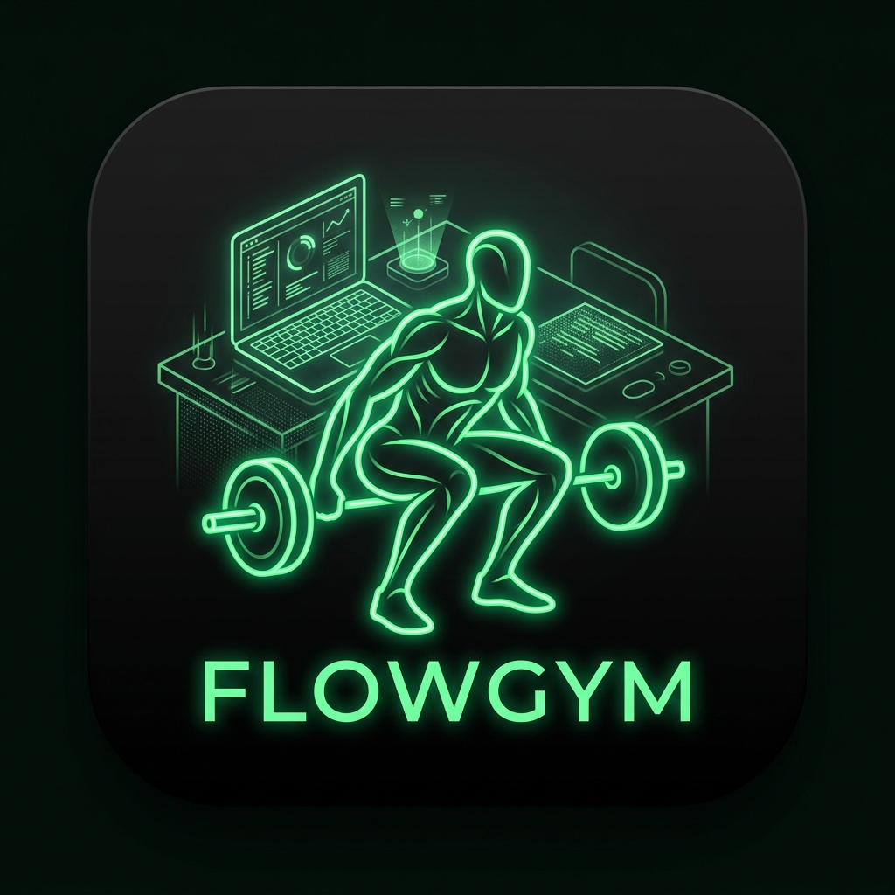

# FlowGym (心流健身) 🧘‍♂️💻

<p align="left">
  
</p>

**演示视频**: [点击查看抖音演示](https://v.douyin.com/yep7XMAjvPg/)

**让你的每一次按键，都成为一次律动。**

`FlowGym` 是一款专为 Mac 用户打造的“办公即健身”生产力工具。它利用先进的 AI 动作捕捉技术，将你的身体姿态（如深蹲、跳跃、挥拳）直接转换为精准的键盘和鼠标指令。

无论是在编写代码还是回复邮件，`FlowGym` 都能让你在保持工作心流（Flow）的同时，完成肌肉的唤醒与锻炼（Gym）。

---

## ✨ 核心特性

- **AI 姿态检测**：基于 Apple Vision 框架，实时检测 17 个人体关键点，灵敏度高且资源占用及低。
- **工作流融合**：将运动动作与高频办公操作（如语音输入、翻页、发送消息）完美映射。
- **极简 HUD**：半透明窗口实时反馈动作捕捉状态，支持原生丝滑拖动。
- **学习模式**：支持根据不同应用程序自定义输入框焦点。
- **开箱即用**：打包为标准的 `.app` 格式，双击即可开启健康办公之旅。

---

## 🎮 动作控制说明书

| 动作标识 | 物理动作描述 | 映射功能 |
| :--- | :--- | :--- |
| 🏋️ **深蹲** | 身体重心明显下潜并保持 | **语音输入** (按下 Fn 键) |
| 👏 **拍手** | 双手在胸前快速合十 | **Enter** (确认/换行) |
| ❌ **双手交叉** | 在胸前呈 X 状交叉 | **Escape** (取消/返回) |
| 👊 **左右出拳** | 向前、向左或向右出拳 | **← / →** 方向键 |
| 💪 **侧平举** | 单臂向侧面平行举起 | **Tab** 切换标签页 |
| ⛹️ **跳跃** | 身体重心快速上升 | **Enter** (快速发送消息) |
| 🤚 **右手高举** | 右手举过头顶 | **鼠标点击** 屏幕中心 |
| ⚙ **学习模式** | 点击 UI 中的“配置”按钮 | 记录输入框坐标实现精准聚焦 |

---

## 🚀 安装与分发

### 方式一：直接运行 (推荐)
1. 下载并打开 `FlowGym.app`。
2. 将窗口拖动到屏幕不干扰工作的角落。
3. 点击 [❓ 帮助] 熟悉动作。

### 方式二：从源码构建
如果你希望针对自己的电脑进行优化，可以按照以下步骤构建：
1. **克隆仓库**:
   ```bash
   git clone https://github.com/zhulin025/FlowGym.git
   ```
2. **编译 Release 版**:
   ```bash
   swift build -c release
   ```
3. **自动化打包**:
   ```bash
   chmod +x package.sh
   ./package.sh
   ```
完成后，根目录下将生成最新的 `FlowGym.app`。

---

## 💻 硬件与系统要求

| 硬件类型 | 兼容性状态 | 说明 |
| :--- | :--- | :--- |
| **Apple Silicon (M1/M2/M3)** | ✅ **完美支持** | 推荐使用。利用神经网络引擎（NE）实现超低延迟捕捉。 |
| **Intel 芯片 Macs** | ⚠️ **支持运行** | 支持运行，但由于缺少专门的 AI 加速，部分算法会导致 CPU 占用较多。 |
| **操作系统** | 🍏 **macOS 14.0+** | 建议使用 Sonoma 或更高版本以获得最佳稳定性。 |

---

## 🛡 隐私与安全性

`FlowGym` 所有的视觉计算均在**本地实时进行**，不会保存或上传任何图像数据。为了保证正常工作，首次启动时您需要：
1. **摄像头权限**：用于身体姿态检测。
2. **辅助功能权限**：在 `系统设置 -> 隐私与安全性 -> 辅助功能` 中勾选 **FlowGym**，允许它模拟按键。

---

## 👨‍💻 致谢

本项目是在 [fifteen42/vibemove](https://github.com/fifteen42/vibemove/) 的基础上进行了重构、UI 优化以及功能扩展。感谢原作者提供的核心姿态识别灵感。

## 📄 开源协议

本项目采用 **MIT License**。
Copyright (c) 2026 **fifteen42**
Copyright (c) 2026 **zhulin025**
